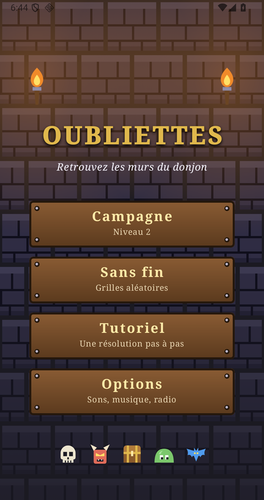
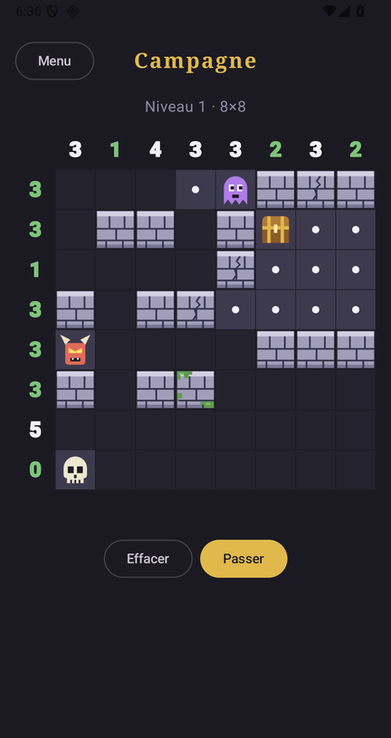
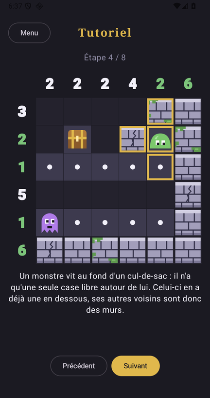
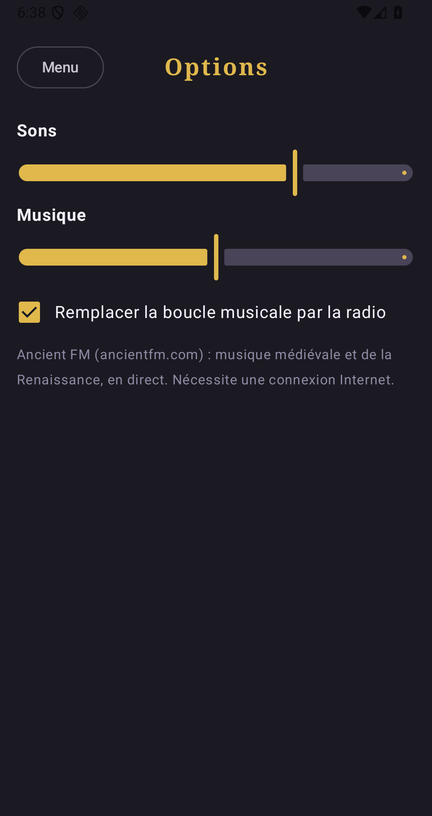

# Oubliettes

A logic puzzle game for Android: work out where the dungeon walls are from the clues.

<p align="center">
  
  
  
  
</p>

## Rules

- The numbers along the edge of the grid give the number of walls in each row and column.
- Monsters and chests are never walls.
- Every monster sits in a dead end, and every dead end holds a monster.
- Every chest is in a treasure room: 3×3 open cells, a single chest (anywhere in the room), a single opening.
- Outside treasure rooms, hallways are one cell wide (no open 2×2 block).
- All open cells are connected.

Tap a cell to cycle it: unknown, wall, known open. Drag to paint several cells. A count turns green when
its row or column has the right number of walls, red when it has too many.

Every grid has exactly one solution.

## Modes

- **Campaign**: one sequence of levels with fixed seeds, so level *n* is the same grid for everyone.
  Grids grow from 8×8 (levels 1–10) to 10×10 (11–25) and 12×12 (26 and up).
- **Endless**: randomly generated grids in the size you pick.
- **Tutorial**: a small dungeon solved one deduction at a time, showing each rule at work.

Progress on the current grid is saved after every move and restored on the next launch.

## Sound

Options has volume sliders for sound effects and music. The music is a bundled 80-second medieval loop;
a checkbox replaces it with the live stream of [Ancient FM](https://ancientfm.com/) (medieval and
Renaissance music, needs an Internet connection — the only thing the app uses the network for).

The loop and the sound effects are synthesised by `tools/make_audio.py` (needs numpy and ffmpeg).

The interface is in French.

## Install

Download the APK from the [releases](https://github.com/all3f0r1/oubliettes/releases) and open it on your phone (Android 8.0+).

## Build

Requires JDK 21 and the Android SDK.

```sh
./gradlew assembleDebug        # app/build/outputs/apk/debug/app-debug.apk
./gradlew testDebugUnitTest
```

A signed release build needs the keystore at `release.jks` and its password:

```sh
./gradlew assembleRelease -PkeystorePassword=...
```

See the [changelog](CHANGELOG.md) for what each version brought.
