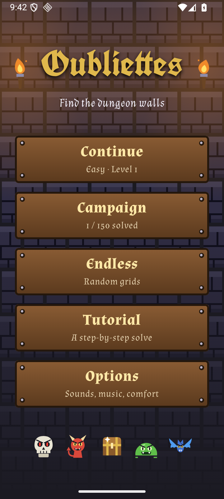
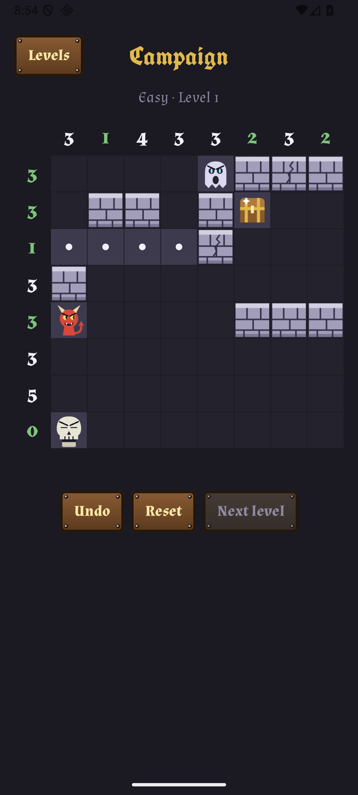
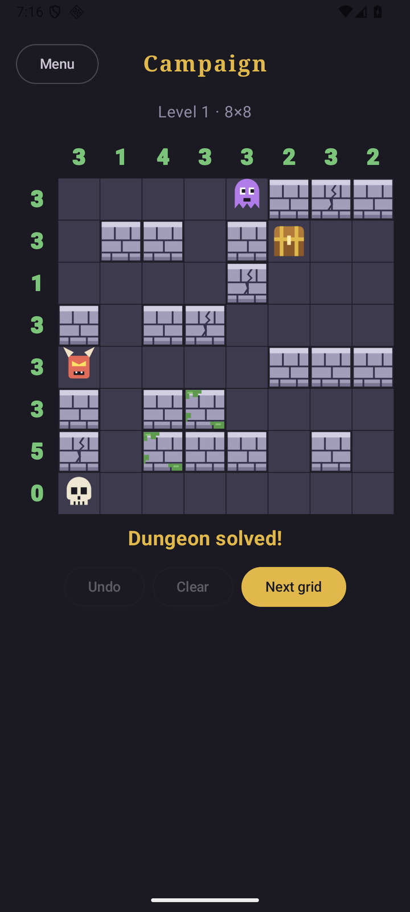
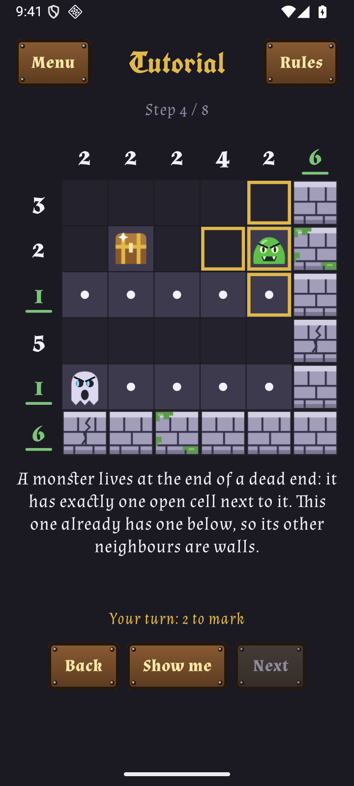
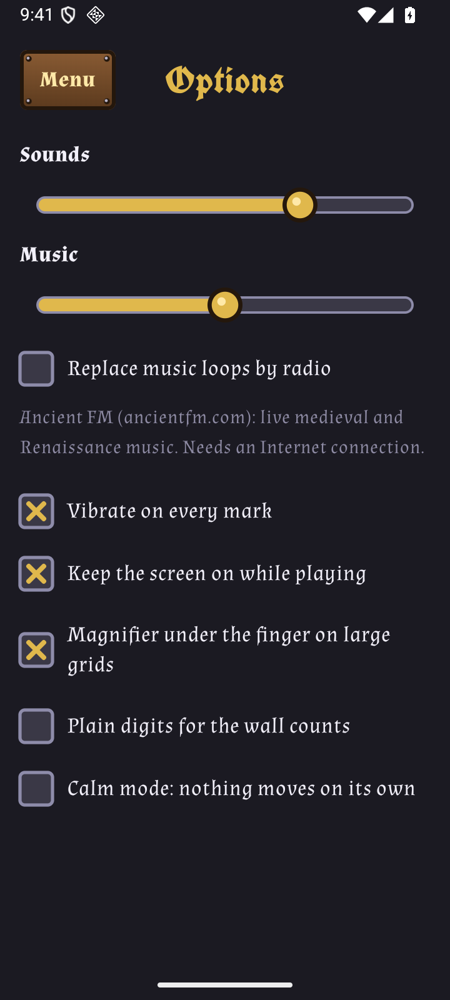
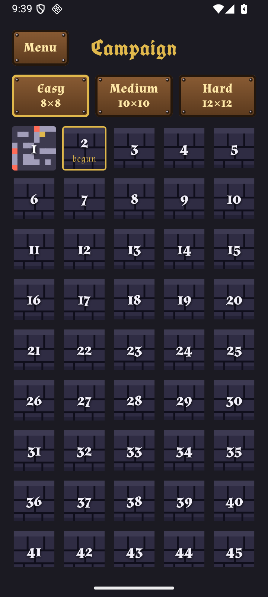

# Oubliettes

A logic puzzle game for Android: work out where the dungeon walls are from the clues.

<p align="center">
  
  
  
  
  
  
</p>

## Rules

- The numbers along the edge of the grid give the number of walls in each row and column.
- Monsters and chests are never walls.
- Every monster sits in a dead end, and every dead end holds a monster.
- Every chest is in a treasure room: 3×3 open cells, a single chest (anywhere in the room), a single opening.
- Outside treasure rooms, hallways are one cell wide (no open 2×2 block).
- All open cells are connected.

Every grid has exactly one solution. Generated grids also never have walls more than two cells thick
(no 3×3 block of walls), which you can use as a clue.

## Controls

- Tap a cell to cycle it: unknown, wall, known open.
- **Wall** and **Dot**, under the grid, choose what a tap lays instead: that mark at the first tap, or
  nothing if the cell already had it. Tap the chosen plank again to go back to the cycle. The choice
  is kept from one grid to the next.
- Drag to fill a row or a column: the drag stays on the line it started along and fills unknown
  cells, plus the cells of your previous action (drag again over a drag to fix it). Older marks are
  never overwritten. However fast the finger goes, every cell it crosses is filled, and only the
  finger that started a drag draws.
- **Undo** takes back the last action (a whole drag counts as one) and **Redo** brings it back.
  **Reset** empties the grid, and is an action like any other: Undo restores the marks. The last 50
  actions of every unfinished grid are kept, even after leaving the app.
- A count turns green and underlined when its row or column has the right number of walls (which
  does not prove they are the right ones), red and struck through when it has too many.
- The row and the column of the cell touched last are lit up to their counts. On grids whose cells
  are smaller than a fingertip (10×10 and 12×12 on a phone), a magnifier shows what is under the
  finger.
- **Rules**, under every grid, shows the rules without leaving it.
- The grid and its planks rest on the bottom of the screen, under the thumb.

## Modes

- **Campaign**: three difficulties, Easy (8×8), Medium (10×10) and Hard (12×12), with 50 levels each.
  The 150 grids ship with the app, so level *n* is the same grid for everyone and stays the same
  from one version to the next. All levels are open from the start; the table of levels shows which
  ones are begun, and a small picture of each dungeon you solved.
- **Endless**: randomly generated grids in the size you pick. A grid counts as solved the moment it
  is, once; a new one comes after that. **New grid** leaves a grid you do not want to finish, and
  asks first when it has marks, since they are lost. Digging stops as soon as you leave, and gives up (offering
  another grid) rather than search forever.
- **Tutorial**: a small dungeon solved one deduction at a time. You mark the cells of each step
  yourself, or ask to be shown.
- **Continue**, on the main menu, reopens the grid you played last.

Progress on every grid is saved after every action and restored on the next launch. A save holds a
fingerprint of its grid, and Endless saves the grid itself: marks can never land on another grid.

## Options

- Vibration on every mark, and keeping the screen on while a grid is shown.
- Being told when every count is met but a rule is broken (off by default; it never says which rule
  or where).
- The magnifier on large grids.
- Plain digits for the wall counts, instead of the calligraphic ones.
- Calm mode: monsters, chests and torches stop moving. It starts on when the system animations are
  turned off.

## Accessibility

Every cell and every count is exposed to screen readers such as TalkBack: its row and column, what
it holds, and actions to mark it (double-tap cycles it; Wall, Open and Unknown are offered as
custom actions). A solved grid, the tutorial's turn and the chosen size or mark are announced, and
screen titles are headings. Counts and chosen planks do not rely on colour alone, screens scroll when they do not fit (small
screens, large fonts), and calm mode stops all motion.

## Sound

Options has volume sliders for sound effects and music. The music holds the audio focus while it
plays: it stays silent when another app is already playing (your own music or a podcast keeps
going), stops when another app starts, and comes back afterwards. The music is a bundled 80-second medieval loop, with
a shorter and calmer 24-second one for the menus, both played from memory so that they loop without a gap; a checkbox replaces them with the live stream of [Ancient FM](https://ancientfm.com/) (medieval and
Renaissance music, needs an Internet connection — the only thing the app uses the network for).

The loops and the sound effects are synthesised by `tools/make_audio.py` (needs numpy and ffmpeg).

## Install

Download the APK from the [releases](https://github.com/all3f0r1/oubliettes/releases) and open it on your phone (Android 8.0+).

## Build

Requires JDK 21 and the Android SDK.

```sh
./gradlew assembleDebug        # app/build/outputs/apk/debug/app-debug.apk
./gradlew testDebugUnitTest lintDebug
```

The rules, the solver, the generator and the campaign file are tested in `GameTest`; drags, undo,
redo, reset and saves in `SessionTest`. `app/src/main/res/raw/campaign.txt` holds the campaign, one
grid per line: it is frozen, a test fails if it changes.

A signed release build needs the keystore at `release.jks` and its password:

```sh
./gradlew assembleRelease -PkeystorePassword=...
```

See the [changelog](CHANGELOG.md) for what each version brought.

## F-Droid

The store listing (descriptions, screenshots, per-version changelogs) lives in `metadata/`, in the
layout F-Droid reads from the source repository. `fdroid/io.github.all3f0r1.oubliettes.yml` is the
draft build recipe to submit to [fdroiddata](https://gitlab.com/fdroid/fdroiddata).

## License

[GPL-3.0-or-later](LICENSE). The music and sound effects are original and covered by the same license.

The fonts, [UnifrakturCook](https://fonts.google.com/specimen/UnifrakturCook) and
[Almendra](https://fonts.google.com/specimen/Almendra), are under the SIL Open Font License: see `LICENSES/`.
